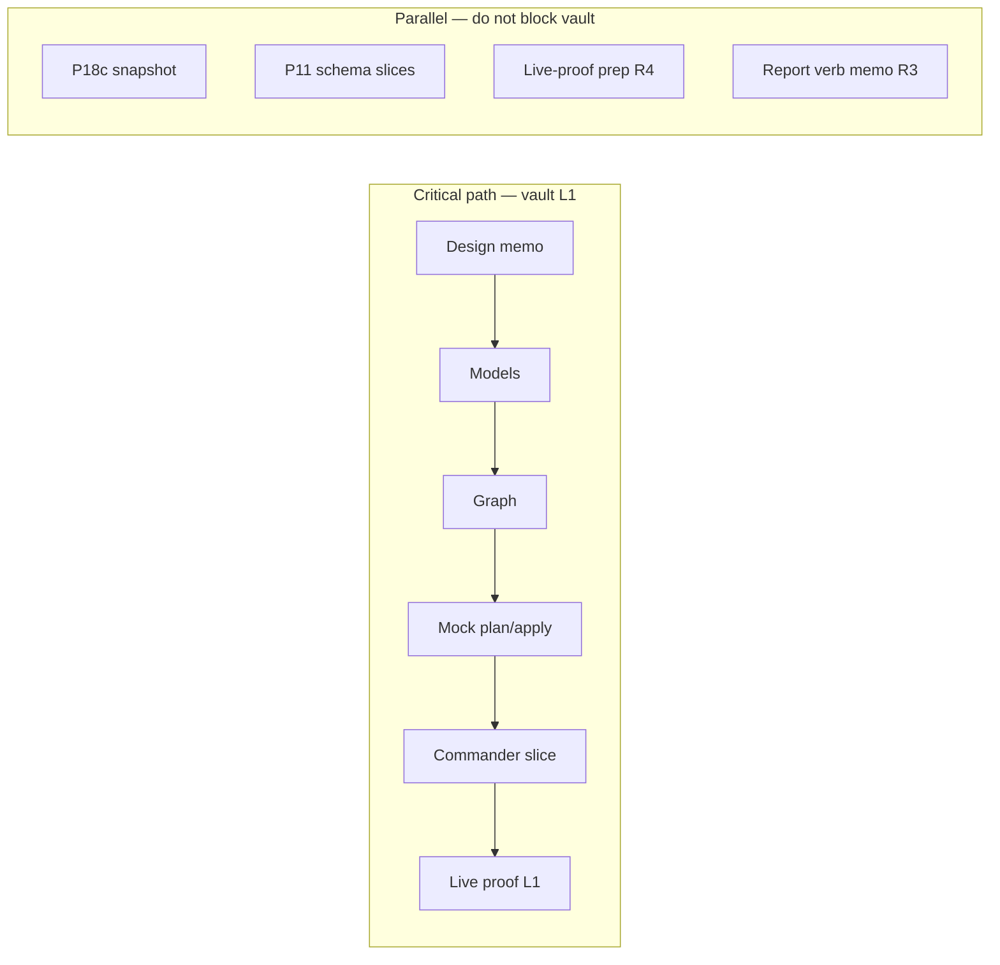

# Heavy orchestration — PAM parity program & vault L1

**Purpose:** Give integrators and workers a **single flight deck** for lifting
non-PAM families toward the [PAM bar](./PAM_PARITY_PROGRAM.md) without scope
creep, merge trains colliding, or “schema shipped = GA” confusion.

**Authority stack (read order on cold start):**

1. [PAM_PARITY_PROGRAM.md](./PAM_PARITY_PROGRAM.md) — Definition of Done + phases.
2. [V2_DECISIONS.md](./V2_DECISIONS.md) — families, runtime scope, MSP/EPM, out-of-scope.
3. [CONVENTIONS.md](../keeper_sdk/core/schemas/CONVENTIONS.md) — schema + live-proof field rules.
4. [NEXT_SPRINT_PARALLEL_ORCHESTRATION.md](./NEXT_SPRINT_PARALLEL_ORCHESTRATION.md) — **wave mechanics**, R/F package IDs, tenant serialization, worker preambles.
5. [AGENTS.md](../AGENTS.md) — CLI contract, live execution grant, exit codes.

This doc **does not replace** `NEXT_SPRINT_*`; it **binds** vault L1 work to those
mechanics and names concrete PR slices.

**Time-ordered execution (phases A–E, checklists, metrics):**
[`EXECUTION_PLAN_HEAVY_ORCHESTRATION.md`](./EXECUTION_PLAN_HEAVY_ORCHESTRATION.md).

**Master plan to orchestrate through Tier A/B/C exit:**
[`ORCHESTRATION_UNTIL_COMPLETE.md`](./ORCHESTRATION_UNTIL_COMPLETE.md).

---

## 1. State machine (where we are)

| Gate | Meaning | Status (vault `keeper-vault.v1` vs PAM) |
|:----:|---------|----------------------------------------|
| G0 | Packaged JSON Schema per family | **Done** (both) |
| G1 | `resolve_manifest_family` + `validate_manifest` + `dropped-design` guard | **Done** (both) |
| G1a | `dsk validate --json` + `examples/scaffold_only/` CI | **Done** (both) |
| G2 | Typed models for family **F** | **Vault: ◐** — `vault_models.py` + `load_vault_manifest` shipped; **complete** when [`VAULT_L1_DESIGN.md`](./VAULT_L1_DESIGN.md) §7 signed (see [`ORCHESTRATION_UNTIL_COMPLETE.md`](./ORCHESTRATION_UNTIL_COMPLETE.md) §2). **PAM: Done.** |
| G3 | `build_graph` / ref rules for **F** | **Vault: Done** — `build_vault_graph` + `vault_record_apply_order`. **PAM: Done** (`graph.py`). |
| G4 | `MockProvider` discover + diff + plan for **F** | **Vault: Done** — `compute_vault_diff` + mock round-trip tests. **PAM: Done.** |
| G5 | `CommanderCliProvider` slice for **F** | **Vault: Done** — `login` discover filter; `_apply_vault_plan` (`RecordAddCommand`, v3 `RecordEditCommand` UPDATE + `return_result` guard, `_write_marker`, `rm`); `dsk validate --online`; semantic scalar `login` diff. **PAM: Done.** |
| G6 | Live proof + `x-keeper-live-proof` + matrix row | **Vault: Open** (V8). **PAM: Done** (proven paths). |

Canonical per-family ticks: [`ORCHESTRATION_UNTIL_COMPLETE.md`](./ORCHESTRATION_UNTIL_COMPLETE.md) §2. Anything below **vault G6** is **not** “GA like PAM” for `keeper-vault.v1` in README or support language.

---

## 2. Critical path vs parallel lanes



**Rule:** `CommanderCliProvider` + **lab tenant** mutations sit on the **critical
path** only — one actor at a time per tenant ([NEXT_SPRINT §2](./NEXT_SPRINT_PARALLEL_ORCHESTRATION.md)).

---

## 3. Vault L1 merge train (recommended PR sequence)

**Status pointer:** for **today’s** `keeper-vault.v1` G2–G6 ticks, use **§1**
above and [`ORCHESTRATION_UNTIL_COMPLETE.md`](./ORCHESTRATION_UNTIL_COMPLETE.md) §2.
The table below is a **historical merge-train** (pedagogical slice order): “Delivers”
text reflects intent **at that PR’s era** (e.g. V1 before later PRs) and can read
stale versus `main` — it is **not** a second source of truth.

Each row is a **mergeable** unit; integrator runs **full** `pytest` + `ruff` +
`mypy` + `sync_upstream.py --check` (if touched) before merge.

> **Skim:** if any “Delivers” / “Touches” cell below disagrees with `main`, treat **§1**
> + [`ORCHESTRATION_UNTIL_COMPLETE.md`](./ORCHESTRATION_UNTIL_COMPLETE.md) §2 as authoritative — this table is **chronological**, not a second status source.

| PR | Title (suggested) | Delivers | Touches (typical) | Blocked by |
|:--:|-------------------|----------|-------------------|--------------|
| **V0** | `docs: vault L1 design memo` | Marker convention, folder UID scope, `LiveRecord` mapping for vault records, explicit **non-goals** for slice 1 | `docs/VAULT_L1_DESIGN.md` (new) | Product nod on scope |
| **V1** | `core: keeper-vault typed models` | Pydantic + `load_vault_manifest`; **§7 sign-off** closes V1 fully; **no** CLI/graph yet | `keeper_sdk/core/vault_models.py`, `tests/test_vault_models.py` | V0 body (design) stable |
| **V2** | `core: vault uid_ref graph` | Graph builder or `graph.py` dispatch; ref cycles for vault `uid_ref` / `folder_ref` | `keeper_sdk/core/vault_graph.py`, `tests/test_vault_graph.py` | V1 |
| **V3** | `core+providers: mock vault discover/plan` | `compute_vault_diff` + existing `MockProvider` + `build_plan` / `vault_record_apply_order` | `keeper_sdk/core/vault_diff.py`, `tests/test_vault_mock_provider.py` | V2 |
| **V4** | `cli+manifest: typed dispatch` | **Option A:** `load_declarative_manifest` + plan/diff/apply branch (vault + PAM); `load_manifest` stays PAM-only | `manifest.py`, `cli/main.py` | V3 |
| **V5** | `providers: commander vault discover` | Same ``ls``/``get`` path; **login-only** filter when ``manifest_source`` is vault | `commander_cli.py`, `tests/test_commander_cli.py` | V4 |
| **V6** | `providers: commander vault apply` | ``_apply_vault_plan``: ``RecordAddCommand`` + v3 ``RecordEditCommand`` UPDATE (:meth:`~keeper_sdk.providers.commander_cli.CommanderCliProvider._vault_apply_login_body_update`, ``return_result`` guard) + :meth:`_write_marker` + ``rm``; ``dsk validate --online`` + semantic ``login`` diff land with V4/V5; live **idempotency** proof = **V8** | `commander_cli.py`, `cli/main.py`, `keeper_sdk/core/diff.py` | V5 |
| **V7** | `core+providers: vault-sharing slice` | Sharing models/graph/mock/Commander **or** second wave after V6 stable | `keeper-vault-sharing` paths | V6 for patterns |
| **V8** | `docs: vault L1 live proof` | Sanitized transcript, schema `x-keeper-live-proof`, matrix, README row (prep: [`keeper-vault.v1.sanitized.template.json`](./live-proof/keeper-vault.v1.sanitized.template.json) + sample [`examples/scaffold_only/vaultOneLogin.yaml`](../examples/scaffold_only/vaultOneLogin.yaml)) | `docs/live-proof/`, schemas, `CAPABILITY_MATRIX.md`, `README.md` | L1 tenant run |

**Anti-pattern:** V5 and V6 in one mega-PR unless the integrator explicitly
accepts review burden.

*Historical note:* **V1** “Delivers” still says “no CLI/graph yet” (original slice
boundary); later PRs added CLI + graph — do not infer current repo layout from that
cell alone.

---

## 4. Parallel work map (NEXT_SPRINT IDs ↔ PAM parity)

Use [NEXT_SPRINT §3](./NEXT_SPRINT_PARALLEL_ORCHESTRATION.md) package table for
**R1–R4 / F1–F4**. Mapping:

| PAM parity need | Same sprint lane (example) | Notes |
|-----------------|----------------------------|-------|
| P18c measurement | **F1** after **R1** | Improves matrix honesty; does not unblock vault typed core |
| P11 enterprise JSON | **F2a/F2b** after **R2a/R2b** | Disjoint files per worker |
| Live-proof hygiene | **R4** → **F3** | Checklist before **V8** |
| Fourth `dsk report` verb | **F4** after **R3** | P17 bar; orthogonal to vault |

**Vault train (§3)** should **not** wait on P18c; it **should** consume R4 output
before V8.

---

## 5. Worker dispatch — three copy-paste preambles

### 5.1 Readonly (memo / audit)

```text
Task type: READONLY (no repo edits unless explicitly allowed).
Read first: keeper_sdk/core/schemas/CONVENTIONS.md, docs/V2_DECISIONS.md Q1,
  docs/PAM_PARITY_PROGRAM.md, docs/ORCHESTRATION_PAM_PARITY.md §3 PR=Vx.
Forbidden: keeper_sdk/providers/commander_cli.py (unless task says),
  .github/workflows, live tenant commands.
Output: memo sections + DONE dump; LESSON CANDIDATE if drift found.
```

### 5.2 Offline impl (tests + core + mock)

```text
Task type: OFFLINE IMPL.
Read first: docs/VAULT_L1_DESIGN.md (or latest vault memo), CONVENTIONS.md.
Scope: only paths listed in task body; no Commander subprocess.
Run before handoff: python3 -m pytest tests/<your_new_test>.py -q
```

### 5.3 Commander-touching (foreground, serial)

```text
Task type: COMMANDER SLICE — coordinate with integrator for tenant lockout.
Read: AGENTS.md Autonomous execution, docs/live-proof/README.md.
All subprocess argv + redaction must be in task body or memo.
Run: targeted pytest with mocks; live run is integrator/parent only unless granted.
```

---

## 6. Integrator checklist (every merge wave)

- [ ] **Branch:** integration branch or strict merge order on `main`.
- [ ] **Tests:** `python3 -m pytest -q` full suite green.
- [ ] **Lint:** `ruff check .` + `ruff format --check` + `mypy keeper_sdk`.
- [ ] **Drift:** if `scripts/sync_upstream.py` or matrix touched → `--check` green.
- [ ] **Docs:** README “Readiness” row only if **G6**-equivalent for that family.
- [ ] **Support claims:** no “GA” language without SDK_DA / PAM bar gates.
- [ ] **Tenant:** at most one live writer; evidence sanitized before commit.

---

## 7. CI ladder (workflows vs pytest)

| Where | What runs today |
|------|-----------------|
| **`examples` job** (`.github/workflows/ci.yml`) | `dsk validate` on **`examples/*.yaml`** and **`examples/scaffold_only/*.yaml`**. Mock **`dsk --provider mock plan`** on **`examples/*.yaml`** only (PAM manifests). |
| **pytest** | `keeper-vault.v1` **plan / diff / apply** (mock + fakes), `validate --json`, `compute_vault_diff`, etc. — see `tests/test_vault_mock_provider.py`, `tests/test_cli.py`, `tests/test_vault_diff.py`, … |
| **Optional CI hardening** | Add **one** `examples/scaffold_only/vault*.yaml` to the **`examples` job plan loop** if you want CI duplicate guardrails beyond pytest (not required on current `main`). |
| **Live** | Credentialed smoke / L1 runs stay in **separate** workflows or harnesses per `AGENTS.md` — not in default public CI. |

---

## 8. Blocker template (JOURNAL / PR comment)

```text
BLOCKER: <vault L1 | P18c | P11 | …>
Symptom: <what failed>
Evidence: <command + exit code + path:line if code>
Hypothesis: <one sentence>
Next: <owner + unblocker: memo decision | tenant | pin bump | defer>
```

---

## 9. Program exit

“Heavy orchestration” succeeds when:

1. **Vault + vault-sharing** rows in README **Readiness** flip to **Yes** with
   evidence paths, **or** blockers are explicitly documented with un-drop
   triggers.
2. **P18c** makes matrix percentages **machine-backed** (F1 done).
3. **NEXT_SPRINT §16** post-sprint review updates the next wave table.

Until then: ship small PRs from §3, keep parallel lanes in §4 fed with readonly
memos, and **serialize** only tenant + `main` integration.

**Next:** open [`EXECUTION_PLAN_HEAVY_ORCHESTRATION.md`](./EXECUTION_PLAN_HEAVY_ORCHESTRATION.md) at **Phase 0** and tick through.
